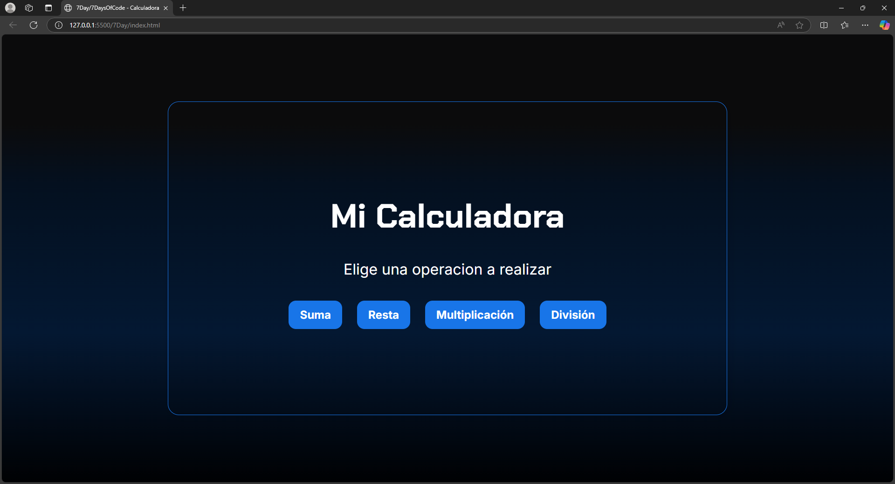
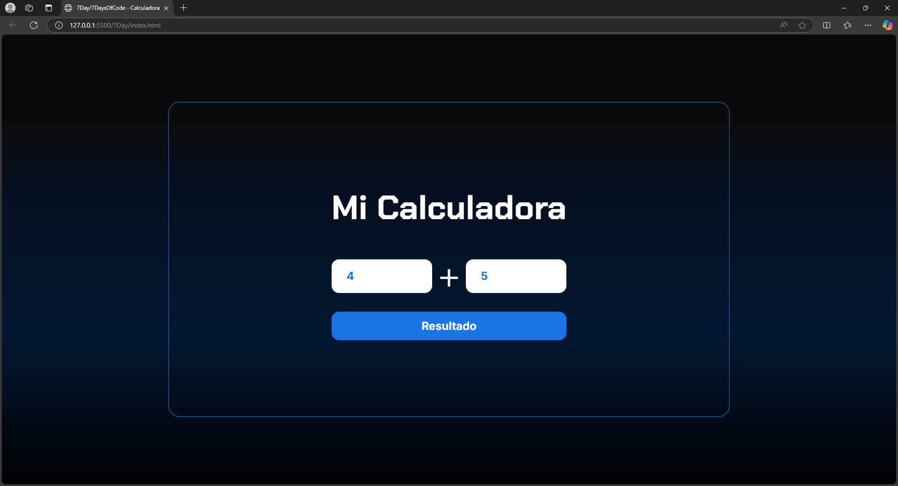
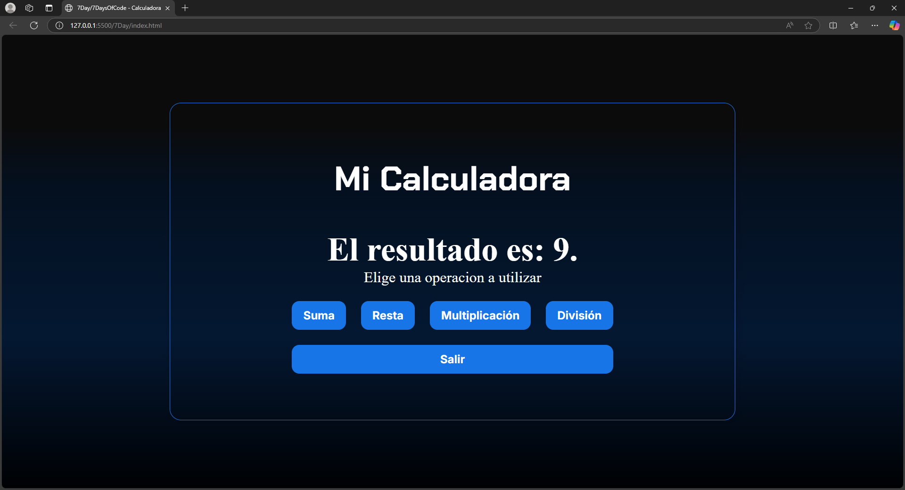
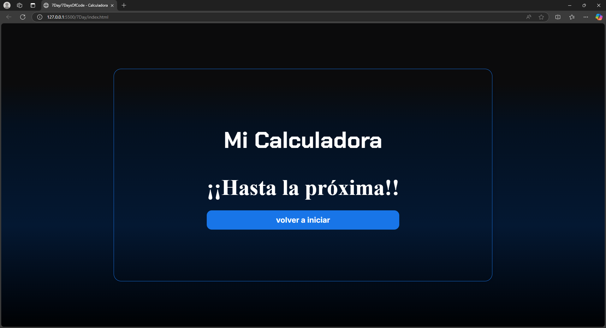

# Día 7: Funciones en javascript - Calculadora🖩


---

Este proyecto es parte del desafío #7DaysOfCode, donde aprendí a mejorar la organización del código mediante funciones en JavaScript. En esta ocasión, desarrollé una calculadora interactiva que permite realizar operaciones matemáticas básicas.  
En este proyecto aprendí sobre la modularización del código en JavaScript y cómo las funciones ayudan a mantener el código organizado y reutilizable. ¡Una excelente práctica para mejorar como desarrollador! 🚀

## 🛠️ Tecnologías utilizadas
- HTML5
- CSS3
- JavaScript

### 🚀 Funcionalidades
- Suma, resta, multiplicación y división.
- Interfaz interactiva con HTML, CSS y JavaScript.
- Validación de entrada para evitar errores.
- Uso de funciones para modularizar el código.
- Implementación de estructuras de control como `switch` y `if-else`.

## 📂 Estructura del proyecto
```
📁 Calculadora
│── 📁 Imagenes        # Imagenes utilizadas en el README
│── 📄 app.js          # Lógica de la calculadora
│── 📄 index.html      # Estructura de la calculadora
│── 📄 style.css       # Estilos de la interfaz
│── 📄 README.md       # Documentación del proyecto
``` 

## 🏗️ Cómo ejecutar el proyecto
1. Clona el repositorio
2. Abre el archivo `index.html` en tu navegador favorito.
3. Escoge una de las cuatro operaciones (suma, resta, multiplicación o división).
4. Ingresa los valores.
5. Da clic en el botón **resultado** para mostrar el resultado de la operación.
6. Elige otra operacion a realizar o salir de la apliación.

### 📸 Vista previa






## 📂 Cómo descargar solo la carpeta `7Day` que contiene el programa

Si solo necesitas la carpeta `7Day` sin clonar todo el repositorio, aquí tienes algunas opciones:

### 🚀 **Opción 1: Usar `git sparse-checkout` (Recomendado)**
Si quieres descargar solo esta carpeta usando Git:

```bash
git clone --no-checkout --filter=blob:none --sparse https://github.com/OctavioPinoRosas/7DaysofCode.git
cd 7DaysofCode
git sparse-checkout set 7Day
git checkout
```

Esto descargará únicamente la carpeta `7Day` sin los demás archivos del repositorio.

---

### 🛠 **Opción 2: Usar `svn` (Alternativa sin Git)**
Si tienes `svn` instalado, puedes descargar solo la carpeta con:

```bash
svn checkout https://github.com/OctavioPinoRosas/7DaysofCode/trunk/7Day
```

Esto funciona porque GitHub permite acceso vía **Subversion (`svn`)** a los repositorios.

---

### 📥 **Opción 3: Descargar manualmente los archivos**
Si solo necesitas algunos archivos dentro de `7Day`, puedes:
1. Ir a **7Day en GitHub**
2. Hacer clic en cada archivo individualmente y luego en el botón **"Download"**.

---

💡 **Nota:**
- La opción **1 (`git sparse-checkout`)** es ideal si trabajas con Git.
- La opción **2 (`svn checkout`)** es útil si no quieres clonar todo el repositorio.
- La opción **3 (descarga manual)** es la más sencilla si solo necesitas unos pocos archivos.

## 📜 Licencia
Este proyecto está bajo la licencia MIT.